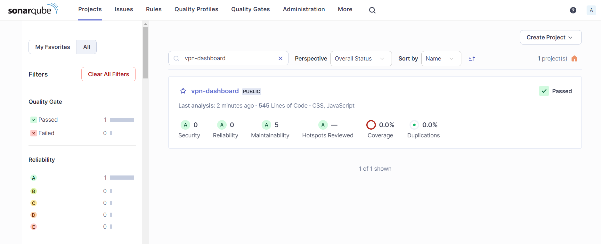
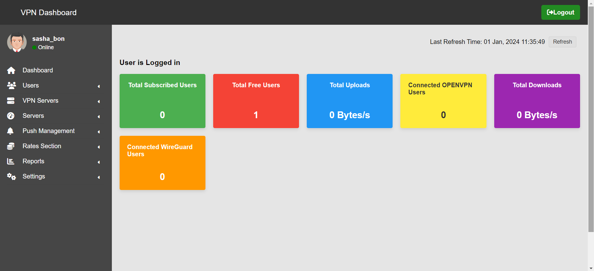

# Vpn Admin Dashboard - NodeJs + ExpressJs App

### Code Quality - Sonarqube

### Dashboard Page
This project is a sample of VPN Dashboard app built with NodeJs + ExpressJs + EJS 

Dashboard access: http://localhost:3000

## Technologies Used
1. NodeJs
2. ExpressJs
3. Npm
4. EJS
5. Sequelize
6. MySql